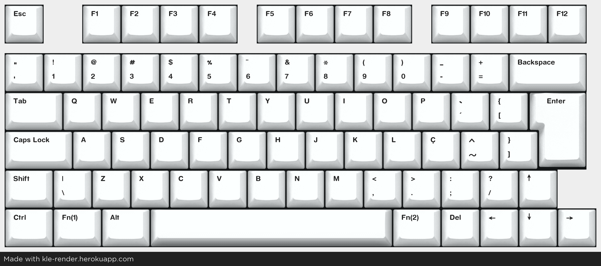

# !!!!!!!!!!!!!!!!!!!!!!!!!!!!!!!!!!!!!!!!!!!!!!!!!!!!!!!!!!!!!!!!!!!!!!!!!!!!!!!!!!
# PCBs have been received and confirmed working, will upload the QMK files soon
# !!!!!!!!!!!!!!!!!!!!!!!!!!!!!!!!!!!!!!!!!!!!!!!!!!!!!!!!!!!!!!!!!!!!!!!!!!!!!!!!!!

# BareDev - A small, yet resourceful keyboard

(Almost as )Compact as a 60% (at least at width), with the f-row and arrows of a 75%. Compatible with QMK.

This is very much tailored to my preferences, with the ISO-turned-ABNT2 layout and right shift sent to the Shadow Realm.

---

Layout:

Links: [KLE](http://www.keyboard-layout-editor.com/#/gists/89e76130aa221e028ccd5b3f6dec0909), [JSON](https://gist.github.com/ManoShu/89e76130aa221e028ccd5b3f6dec0909)

---
